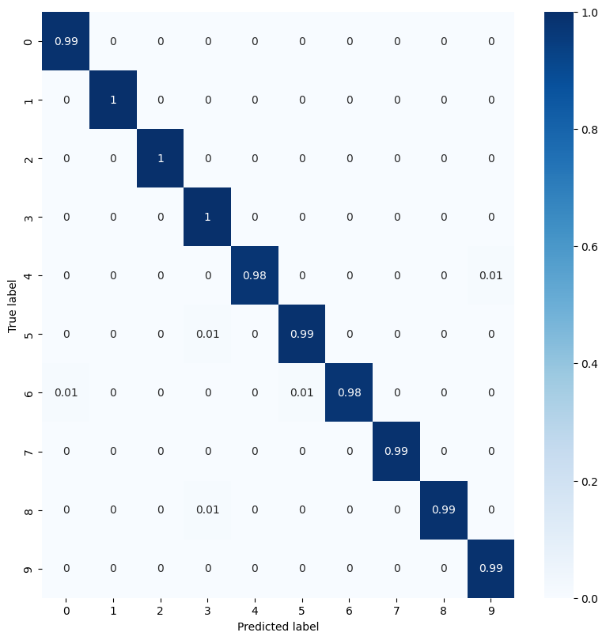
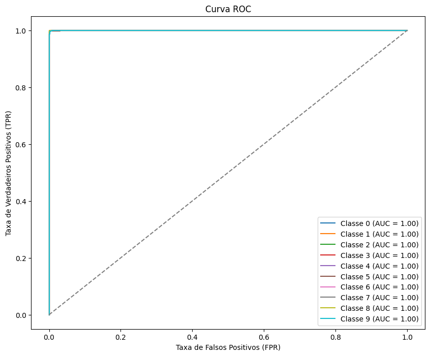

# Projeto: Classificação de Dígitos com MNIST

Este é um projeto de aprendizado de máquina que utiliza o dataset **MNIST** para treinar uma Rede Neural Convolucional (CNN) com o objetivo de classificar imagens de dígitos manuscritos (de 0 a 9). O modelo é desenvolvido com **TensorFlow/Keras** e visualizações com **Matplotlib** e **Seaborn**.

---

## 📝 Descrição do Projeto

O objetivo principal deste projeto é:
- Demonstrar o uso de Redes Neurais Convolucionais (CNNs) para resolver problemas de classificação de imagens.
- Visualizar o desempenho do modelo através de métricas como **matriz de confusão**, **curvas ROC** e outros indicadores de desempenho.
- Explorar o dataset **MNIST**, amplamente utilizado como benchmark para algoritmos de aprendizado de máquina.

---

## 🚀 Tecnologias Utilizadas

- **Python** (versão compatível: 3.10 ou 3.11)
- **TensorFlow/Keras**: para criação e treinamento do modelo de CNN.
- **Matplotlib**: para visualização de gráficos e métricas.
- **Seaborn**: para estilização da matriz de confusão.
- **NumPy**: para manipulação de arrays.
- **Pandas**: para manipulação de dados tabulares.

---

## 📂 Estrutura do Projeto

```plaintext
├── README.md          # Documentação do projeto
├── notebooks/              # Pasta com notebooks Jupyter
│   └── Matriz_Confusão.ipynb # Notebook principal do projeto
├── requirements.txt   # Lista de dependências para instalação
├── logs/              # Diretório para salvar os logs do TensorBoard
└── images/           # Gráficos gerados (opcional)
```

---

## 📊 Funcionalidades

1. **Pré-processamento dos Dados**
   - Carregamento do dataset MNIST.
   - Normalização das imagens para melhorar o desempenho do modelo.

2. **Construção do Modelo**
   - Rede Neural Convolucional (CNN) com múltiplas camadas:
     - Camadas de convolução.
     - Camadas de pooling (MaxPooling).
     - Camadas densas (Fully Connected).

3. **Treinamento e Avaliação**
   - Treinamento por 5 épocas.
   - Validação com o conjunto de teste.
   - Cálculo de métricas como:
     - Acurácia.
     - Sensibilidade (Recall).
     - F-Score.
   - Visualização da Matriz de Confusão e Curvas ROC.

---

## 🖼️ Exemplos de Saídas

### Matriz de Confusão


### Curva ROC


---

## 🔧 Como Executar

### Pré-requisitos

- **Anaconda** (recomendado) ou Python 3.10/3.11 instalado.
- Repositório clonado localmente.

### Passo a Passo

1. Clone o repositório:
   ```bash
   git clone https://github.com/eunafita/calculo-metricas-avaliacao-aprendizado
   cd seu-repositorio
2. Crie um ambiente virtual (recomendado):

```bash

conda create --name mnist_env python=3.10
conda activate mnist_env
```

3. Instale as dependências:

```bash

pip install -r requirements.txt
```

4. Execute o código:

```bash

python ./notebooks/Matriz_Confusão.ipynb
```

(Opcional) Visualize os logs no TensorBoard:

```bash

tensorboard --logdir=logs
```

## 🛠️ Dependências
As bibliotecas necessárias estão listadas no arquivo requirements.txt. Você pode instalar todas com o seguinte comando:

```bash

pip install -r requirements.txt
```

Conteúdo do requirements.txt:

```bash
tensorflow
numpy
matplotlib
seaborn
pandas
```

## 📈 Resultados

Após o treinamento, o modelo alcançou os seguintes resultados:

- Acurácia: 99%
- Sensibilidade Média: 99%
- AUC: 1.0 para todas as classes.

Os gráficos gerados incluem:

- Matriz de Confusão.
- Curvas ROC para cada classe.

## 👩‍💻 Autor
Desenvolvido por Rafael Danilo Santos Bortoluzzi. Sinta-se à vontade para entrar em contato em caso de dúvidas ou sugestões!

## 📜 Licença
Este projeto está licenciado sob a MIT License. Sinta-se à vontade para usá-lo e modificá-lo.


